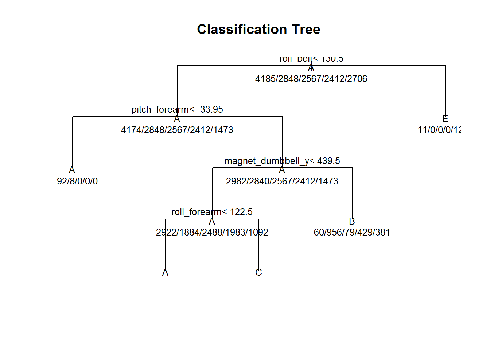
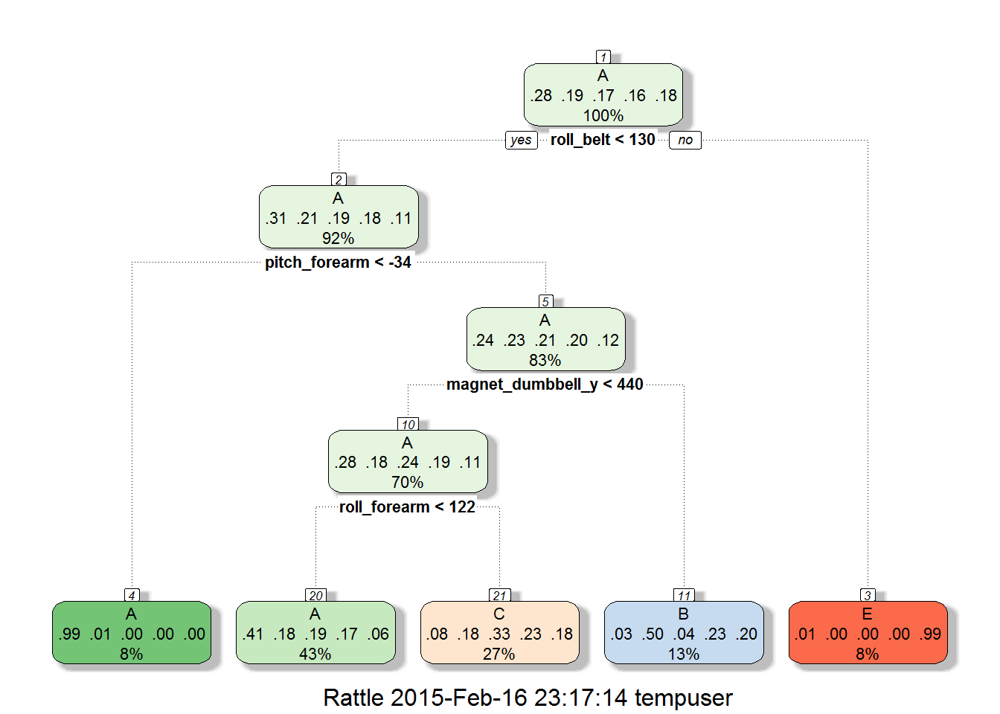

###Background

Using devices such as Jawbone Up, Nike FuelBand, and Fitbit it is now possible to collect a large amount of data about personal activity relatively inexpensively. These type of devices are part of the quantified self movement - a group of enthusiasts who take measurements about themselves regularly to improve their health, to find patterns in their behavior, or because they are tech geeks. One thing that people regularly do is quantify how much of a particular activity they do, but they rarely quantify how well they do it. In this project, your goal will be to use data from accelerometers on the belt, forearm, arm, and dumbell of 6 participants. They were asked to perform barbell lifts correctly and incorrectly in 5 different ways. More information is available from the website here: http://groupware.les.inf.puc-rio.br/har (see the section on the Weight Lifting Exercise Dataset). 

###Loading data and Preprocessing 

I load and process the data into a format suitable for my analysis. I replaced the missing data into "NA".

```{r}
TrainingUrl <- "http://d396qusza40orc.cloudfront.net/predmachlearn/pml-training.csv"
TestingUrl <- "http://d396qusza40orc.cloudfront.net/predmachlearn/pml-testing.csv"
TrainingData <- read.csv(url(TrainingUrl), na.strings=c("NA","#DIV/0!",""))
TestingData <- read.csv(url(TestingUrl), na.strings=c("NA","#DIV/0!",""))
```

load libraries.

```{r}
library(caret)
library(rpart)
library(rpart.plot)
library(RColorBrewer)
library(rattle)
```


Load the same seed with the following line of code and split data into two sets; 75% data is for the training data and reserved 25% for cross-validation.
Delete irrelevant variables such as; user_name, raw_timestamp_part_1, raw_timestamp_part_,2 cvtd_timestamp, new_window, and  num_window.

```{r}
set.seed(313)

inTrain <- createDataPartition(TrainingData$classe, p = 3/4)[[1]] 
myTraining <- TrainingData[inTrain,-c(1:7)]
myTesting <- TrainingData[-inTrain, -c(1:7)]
dim(myTraining); dim(myTesting)

```

```
## [1] 14718   153
## [1] 4904  153
```

I also checked how many columns include NAs.

```{r}
t <- table(colSums(is.na(myTraining)))
t
```

```
## 
##     0 14416 14417 14418 14419 14422 14423 14425 14440 14466 14467 14469 
##    53    68     1     1     4     1     4     2     2     1     1     2 
## 14477 14478 14718 
##     1     6     6
```

53 columns have not include NAs however many of the columns include NA for almost all rows.
I also removed those columns with many NAs.

```{r}
NA_columns <- names(myTraining[,colSums(is.na(myTraining))>14400])
myTrainingClean = myTraining[, !names(myTraining) %in% NA_columns]
myTestingClean = myTesting[, !names(myTesting) %in% NA_columns]

```

###Predicting with rpart model

I used classification trees.

```{r}
myModelCT <- train(classe~., method="rpart", data=myTrainingClean)
print(myModelCT$finalModel)
```

```
## n= 14718 
## 
## node), split, n, loss, yval, (yprob)
##       * denotes terminal node
## 
##  1) root 14718 10533 A (0.28 0.19 0.17 0.16 0.18)  
##    2) roll_belt< 130.5 13474  9300 A (0.31 0.21 0.19 0.18 0.11)  
##      4) pitch_forearm< -33.95 1200     8 A (0.99 0.0067 0 0 0) *
##      5) pitch_forearm>=-33.95 12274  9292 A (0.24 0.23 0.21 0.2 0.12)  
##       10) magnet_dumbbell_y< 439.5 10369  7447 A (0.28 0.18 0.24 0.19 0.11)  
##         20) roll_forearm< 122.5 6387  3783 A (0.41 0.18 0.19 0.17 0.057) *
##         21) roll_forearm>=122.5 3982  2684 C (0.08 0.18 0.33 0.23 0.18) *
##       11) magnet_dumbbell_y>=439.5 1905   949 B (0.031 0.5 0.041 0.23 0.2) *
##    3) roll_belt>=130.5 1244    11 E (0.0088 0 0 0 0.99) *
```

```{r}
plot(myModelCT$finalModel, uniform=TRUE, main="Classification Tree")
text(myModelCT$finalModel, use.n=TRUE, all=TRUE, cex=.8)
```

 

```{r}
library(rattle)
fancyRpartPlot(myModelCT$finalModel)
```



```{r}
PredictResultCT<-predict(myModelCT,myTestingClean)
confusionMatrix(PredictResultCT, myTestingClean$classe)
```

```
## Confusion Matrix and Statistics
## 
##           Reference
## Prediction    A    B    C    D    E
##          A 1279  396  396  371  157
##          B   21  330   29  139  105
##          C   92  223  430  294  241
##          D    0    0    0    0    0
##          E    3    0    0    0  398
## 
## Overall Statistics
##                                          
##                Accuracy : 0.4969         
##                  95% CI : (0.4829, 0.511)
##     No Information Rate : 0.2845         
##     P-Value [Acc > NIR] : < 2.2e-16      
##                                          
##                   Kappa : 0.3416         
##  Mcnemar's Test P-Value : NA             
## 
## Statistics by Class:
## 
##                      Class: A Class: B Class: C Class: D Class: E
## Sensitivity            0.9168  0.34773  0.50292   0.0000  0.44173
## Specificity            0.6238  0.92566  0.79007   1.0000  0.99925
## Pos Pred Value         0.4921  0.52885  0.33594      NaN  0.99252
## Neg Pred Value         0.9497  0.85537  0.88273   0.8361  0.88830
## Prevalence             0.2845  0.19352  0.17435   0.1639  0.18373
## Detection Rate         0.2608  0.06729  0.08768   0.0000  0.08116
## Detection Prevalence   0.5300  0.12724  0.26101   0.0000  0.08177
## Balanced Accuracy      0.7703  0.63670  0.64650   0.5000  0.72049
```


The rpart model is 49.7% accurate on the training data, which is not very accurate.


###Predicting with random forest

```{r}
library(randomForest)
myModel<-randomForest(classe~.,data=myTrainingClean,method="class")
PredictResult<-predict(myModel,newdata=myTestingClean,type="class")
confusionMatrix(PredictResult, myTestingClean$classe)
```

```
## Confusion Matrix and Statistics
## 
##           Reference
## Prediction    A    B    C    D    E
##          A 1395    4    0    0    0
##          B    0  942    7    0    0
##          C    0    3  846    5    0
##          D    0    0    2  798    1
##          E    0    0    0    1  900
## 
## Overall Statistics
##                                         
##                Accuracy : 0.9953        
##                  95% CI : (0.993, 0.997)
##     No Information Rate : 0.2845        
##     P-Value [Acc > NIR] : < 2.2e-16     
##                                         
##                   Kappa : 0.9941        
##  Mcnemar's Test P-Value : NA            
## 
## Statistics by Class:
## 
##                      Class: A Class: B Class: C Class: D Class: E
## Sensitivity            1.0000   0.9926   0.9895   0.9925   0.9989
## Specificity            0.9989   0.9982   0.9980   0.9993   0.9998
## Pos Pred Value         0.9971   0.9926   0.9906   0.9963   0.9989
## Neg Pred Value         1.0000   0.9982   0.9978   0.9985   0.9998
## Prevalence             0.2845   0.1935   0.1743   0.1639   0.1837
## Detection Rate         0.2845   0.1921   0.1725   0.1627   0.1835
## Detection Prevalence   0.2853   0.1935   0.1741   0.1633   0.1837
## Balanced Accuracy      0.9994   0.9954   0.9937   0.9959   0.9993
```

The Random Forest model is 99.5% accurate on the training data.

###Predictions for Test data

I evaluated two models and compared the accuracy. The Random Forest performed well in training set with 99.5% accuracy.

```{r}
predictions.test <- predict(myModel, newdata = TestingData)
data.frame(Predictions = predictions.test)
``` 

```
##    Predictions
## 1            B
## 2            A
## 3            B
## 4            A
## 5            A
## 6            E
## 7            D
## 8            B
## 9            A
## 10           A
## 11           B
## 12           C
## 13           B
## 14           A
## 15           E
## 16           E
## 17           A
## 18           B
## 19           B
## 20           B
```
